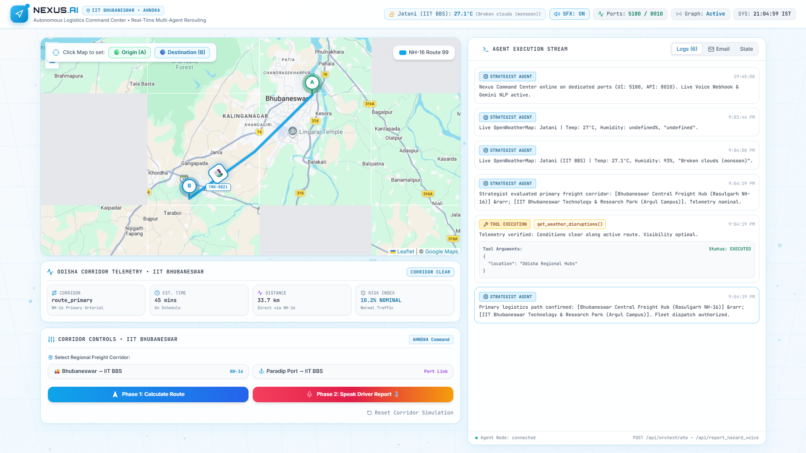
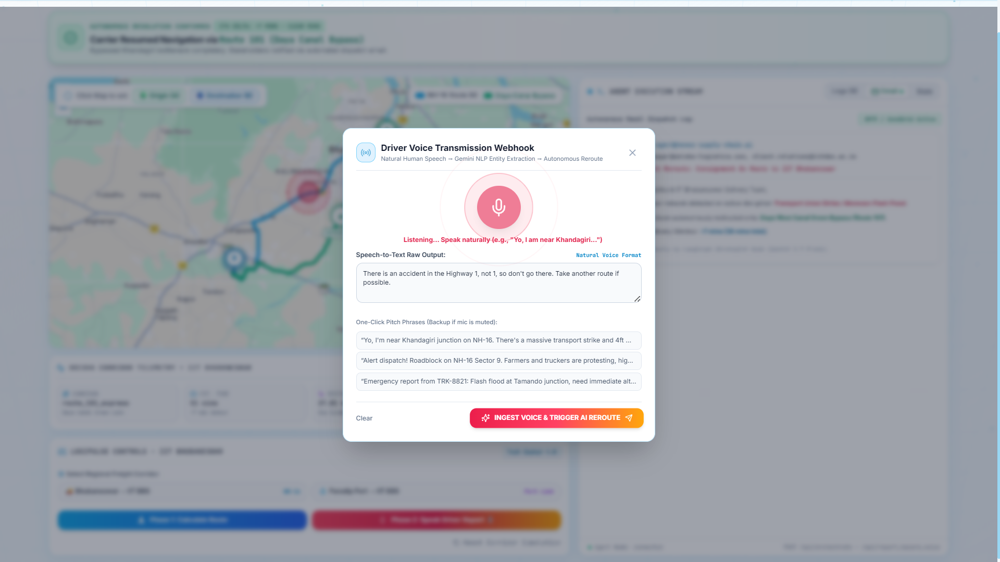
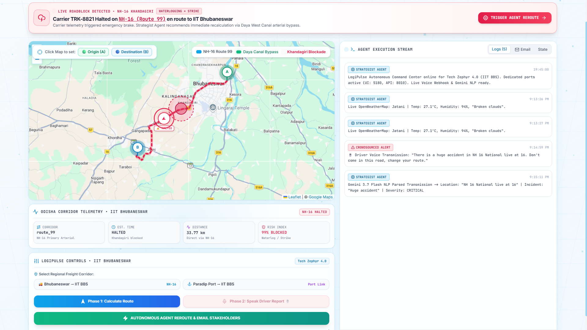
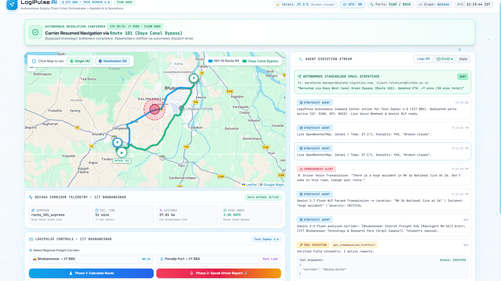
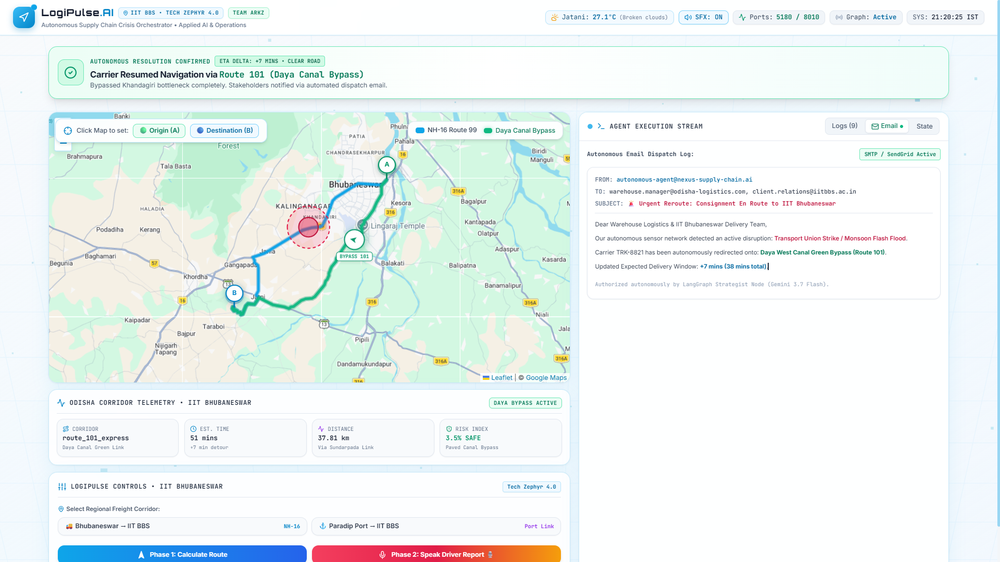

# 🚛 LogiPulse // Autonomous Supply Chain Crisis Orchestrator

[](https://python.org)
[](https://fastapi.tiangolo.com)
[](https://langchain-ai.github.io/langgraph/)
[](https://ai.google.dev)
[](https://react.dev)
[](https://threejs.org)
[](https://tailwindcss.com)
[](https://www.iitbbs.ac.in)
[](#)

> **Self-healing logistics networks powered by LangGraph, Google Gemini, OpenRouteService, and OpenWeatherMap.**  
> Built for **Tech Zephyr 4.0** at **IIT Bhubaneswar** by **Team Arkz**.

---

## 📸 Interactive System Tour & Screenshots

| Phase 1: High-Tech Telemetry & GPS Navigation | Phase 2: Natural Voice Hazard Transmission |
| :---: | :---: |
|  |  |
| *Primary NH-16 freight arterial mapped with real OpenRouteService waypoints.* | *Drivers report accidents, wood blockages, or floods via conversational speech.* |

| Phase 2: Live Incident & Roadblock Detection | Autonomous Green Bypass & Reroute |
| :---: | :---: |
|  |  |
| *Carrier halts automatically; Gemini extracts incident category & severity.* | *Agent calculates Daya West Canal bypass, avoiding the bottleneck.* |

<p align="center">
  <b>Phase 3: Autonomous Stakeholder Notification Email Dispatched</b><br/>
  
  <br/>
  <i>LangGraph Strategist autonomously drafts and delivers urgent dispatch advisories with verified ETAs to client & warehouse inboxes.</i>
</p>

---

## 🌟 Executive Summary

Global supply chains lose billions of dollars annually due to static routing engines that fail when unpredicted real-world disruptions strike. When a multi-vehicle highway accident occurs, storm debris drops fallen logs across an arterial corridor, or a sudden flood halts transport, legacy ERP systems wait hours for human dispatchers to intervene.

**LogiPulse** replaces static dispatching with an **autonomous agentic command center**:
1. **Dynamic Speech-to-NLP Incident Extraction**: Field drivers speak naturally into their mobile device or browser microphone (e.g. *"Terrible accident at Khandagiri junction, cars smashed across both lanes!"* or *"Uprooted trees and heavy wood logs are blocking the highway"*). Google Gemini dynamically classifies the exact category (`ACCIDENT`, `FALLEN_TREE_WOOD`, `WATERLOGGING_FLOOD`, `PROTEST_STRIKE`, `ROAD_BLOCKAGE`) and extracts the location and severity with zero human delay.
2. **LangGraph Strategist Reasoning**: Powered by Google Gemini, the agent continuously evaluates live crowdsourced hazard reports, real-time meteorological conditions (OpenWeatherMap), and actual highway topography (OpenRouteService).
3. **Dynamic Closed-Loop Rerouting**: If a primary corridor (such as NH-16) is blocked, the agent autonomously calculates an intermodal bypass corridor (such as the Daya West Canal arterial) directly into the destination.
4. **Automated Stakeholder Dispatch**: The agent autonomously drafts and transmits formal emergency notifications to the warehouse manager and client with verified ETAs, citing the exact incident reported.

---

## 🗺️ The Scenario: IIT Bhubaneswar Logistics Corridor

The command center is centered on the industrial freight arteries of **Odisha, India**:
- **Primary Origin**: Bhubaneswar Central Freight Depot (Rasulgarh NH-16 Junction)
- **Primary Destination**: IIT Bhubaneswar Technology & Research Park (Argul Campus, Jatni)
- **Primary Corridor (Route 99)**: The critical **NH-16 national arterial** passing through Vani Vihar, Khandagiri, and Pitapalli.
- **The Disruption**: A severe monsoon storm causing a 4-foot flash flood and a transport strike at the **Khandagiri bottleneck**.
- **The Autonomous Resolution (Route 101 Express)**: The agent calculates a safe green bypass through the **Cuttack-Puri Bypass & Daya West Canal / Sundarpada arterial**, delivering cargo directly to IIT Bhubaneswar's South Gate with only a +7 minute delta.

---

## 🏗️ End-to-End System Architecture


---

## ✨ Key Features

### 1. Google Maps-Style High-Tech Command Center
- **Dark-Mode Glassmorphism**: Tailored with custom cyber palettes, backdrop blurs, glowing vector borders, and specular light highlights.
- **3D Interactive Particle Constellation**: Built with **React Three Fiber** and Three.js, responding dynamically to normalized mouse coordinates with organic spring physics.
- **3D Parallax Tilt Cards**: Every metric card subtly tilts along the X and Y axes on hover using Framer Motion springs (`useSpring`, `useMotionValue`).

### 2. Live GPS Tracking with Dynamic Vehicle Physics
- Continuous `requestAnimationFrame` loop that calculates the carrier truck's real-time position `[lat, lon]` and spherical bearing angle.
- **Emergency Deceleration**: When Phase 2 triggers, the truck detects the roadblock and **physically stops before the hazard zone** on the map.
- **Autonomous Vector Pivot**: When the agent executes rerouting, the truck marker rotates onto the Daya Canal bypass and drives straight to IIT Bhubaneswar.

### 3. Real Meteorological & Topographic API Integrations
- **OpenWeatherMap API**: Live temperature, humidity, atmospheric pressure, and weather descriptions for Jatani / IIT Bhubaneswar.
- **OpenRouteService API**: Real road directions extracting 400+ turn-by-turn GPS waypoints, actual highway driving distances (33.7 km), and driving durations.

### 4. Pitch-Friendly Synthetic Web Audio SFX
- Built 100% on the browser's native **Web Audio API** (zero external `.mp3` files, zero latency, works completely offline).
- **Dispatch Alert**: Warm, low-pass filtered dual-frequency sine sweep (240Hz &rarr; 175Hz) that commands attention without overpowering the presenter's voice.
- **Mechanical Click & Harmonic Success Chime**: Crisp haptic-style feedback on user interactions and resolution confirmations.
- **Mute / Unmute Toggle**: Quick button in the header bar for full audio control during the presentation.

### 5. Automated Stakeholder Email Dispatcher
- Autonomously drafts and logs urgent dispatch advisories detailing the incident cause, alternative artery, and revised ETA.
- A dedicated **Email Tab** in the Agent Feed allows judges to inspect the outgoing dispatch message in real-time.

---

## 📁 Repository Structure

```text
agentic-supply-chain/
├── .env                                  # API Keys (Gemini, OpenRouteService, OpenWeather)
├── .gitignore                            # Cleaned: ignores venv, node_modules, dist, secrets
├── README.md                             # Comprehensive project documentation
│
├── frontend/                             # Vite + React 18 Application
│   ├── index.html                        # Dark theme entry, Google Fonts, Leaflet CSS
│   ├── package.json                      # React 18, Three.js, R3F, Leaflet, Framer Motion
│   ├── vite.config.js                    # Port 5180 configuration & /api proxy to 8010
│   ├── tailwind.config.js                # Cyber glow animations, dark palettes, scanlines
│   ├── postcss.config.js
│   └── src/
│       ├── main.jsx                      # React DOM mount
│       ├── App.jsx                       # Split layout, state orchestration, GPS loop
│       ├── index.css                     # Glassmorphism, cyber glow, Leaflet dark invert filter
│       ├── api/
│       │   └── client.js                 # Axios client with fallback simulation engine
│       ├── utils/
│       │   └── soundEffects.js           # Web Audio API synthesizer (dispatch, click, chime)
│       ├── components/
│       │   ├── Header.jsx                # Telemetry header, live weather badge, audio toggle
│       │   ├── MapView.jsx               # Leaflet map, live GPS truck tracking, A/B pins
│       │   ├── ThreeBackground.jsx       # R3F 3D particle constellation & cyber grid
│       │   ├── AgentFeed.jsx             # Terminal timeline, tool calls, email inspector
│       │   ├── DisruptionBanner.jsx      # Urgent pulsing Framer Motion disruption banner
│       │   ├── ControlPanel.jsx          # Mission controls & mobile driver webhook button
│       │   ├── RouteStatsCard.jsx        # Telemetry metrics, ETA, distance, risk factor
│       │   └── ParallaxCard.jsx          # 3D mouse tilt with specular reflection
│       └── data/
│           └── mockRoutes.js             # Odisha freight presets, NH-16, Daya Canal bypass
│
└── src/                                  # LangGraph & FastAPI Backend
    ├── server.py                         # FastAPI on port 8010 with /api/report_hazard
    ├── nodes.py                          # Strategist Node (Gemini 3.7 Flash)
    ├── tools.py                          # 4 Tools: Maps, Weather, Hazard DB, Email
    ├── state.py                          # SupplyChainState TypedDict schema
    └── main.py                           # Standalone CLI entrypoint
```

---

## 🚀 Quick Start Guide

### Prerequisites
- **Python 3.10+** (Tested on Python 3.13)
- **Node.js 18+** & **npm**

### 1. Clone & Configure `.env`
```bash
git clone https://github.com/Arkz-Deepak/agentic-supply-chain.git
cd agentic-supply-chain
```

Create a `.env` file in the project root:
```env
GEMINI_API_KEY=your_google_gemini_api_key
MAP_API_KEY=your_openrouteservice_api_key
WEATHER_API_KEY=your_openweathermap_api_key
```
*(The system also supports `OPENROUTE_API_KEY` and `OPENWEATHER_API_KEY` as aliases).*

---

### 2. Launch the FastAPI Backend (Port 8010)

```powershell
# In root directory:
.\venv\Scripts\python.exe -m uvicorn server:app --app-dir src --host 0.0.0.0 --port 8010 --reload
```
*Backend runs at: **http://localhost:8010***  
*Interactive Swagger API documentation: **http://localhost:8010/docs***

---

### 3. Launch the Vite Frontend (Port 5180)

```powershell
# In frontend directory:
cd frontend
npm install
npm run dev
```
*Command Center runs at: **http://localhost:5180***

> **Note**: Dedicated ports (`8010` and `5180`) ensure complete isolation from other local projects on ports `8000` or `5173`.

---

## 📡 API Reference

### 1. `POST /api/report_hazard`
Webhook for field drivers or IoT systems to report a crisis via text.
```bash
curl -X POST http://localhost:8010/api/report_hazard \
  -H "Content-Type: application/json" \
  -d '{
    "location": "Khandagiri Junction NH-16",
    "description": "Transport union strike & 4ft monsoon waterlogging."
  }'
```

### 2. `POST /api/report_hazard_voice` (Natural Language Speech-to-NLP)
Webhook that accepts raw conversational voice transcripts and extracts structured data with Gemini 3.7 Flash:
```bash
curl -X POST http://localhost:8010/api/report_hazard_voice \
  -H "Content-Type: application/json" \
  -d '{
    "raw_transcript": "Yo, I am from this area near Khandagiri on NH-16 and there is a huge problem right here with a transport union strike and 4ft waterlogging, road is totally blocked!"
  }'
```
**Response (Gemini Entity Extraction):**
```json
{
  "status": "success",
  "parsed": {
    "location": "Khandagiri, NH-16",
    "description": "Transport union strike and 4ft waterlogging causing complete road blockage",
    "severity": "CRITICAL"
  },
  "active_reports": [
    "Khandagiri, NH-16: Transport union strike and 4ft waterlogging causing complete road blockage"
  ]
}
```

### 3. `GET /api/weather`
Fetches real-time weather from OpenWeatherMap for any coordinate (defaults to IIT Bhubaneswar).
```bash
curl http://localhost:8010/api/weather?lat=20.1484&lon=85.6711
```

### 3. `POST /api/routes/directions`
Fetches real highway driving geometry from OpenRouteService.
```bash
curl -X POST http://localhost:8010/api/routes/directions \
  -H "Content-Type: application/json" \
  -d '{
    "start": [20.3010, 85.8640],
    "dest": [20.1484, 85.6711]
  }'
```

### 4. `POST /api/orchestrate`
Executes the LangGraph multi-tool workflow with Google Gemini 2.5 Flash.

---

## 🎯 Hackathon Presentation Pitch Script

| Stage | Action on Screen | Audio / Visual Result | What to Say to the Judges |
| :--- | :--- | :--- | :--- |
| **1. Intro** | Open `http://localhost:5180` | White & Sky-Blue command dashboard loads. 3D particle constellation rotates with cursor. Map focuses on IIT Bhubaneswar. Header displays live weather (`27.1°C • Broken Clouds`). | *"Welcome to LogiPulse, an autonomous agentic crisis orchestrator developed by Team Arkz for Tech Zephyr 4.0 at IIT Bhubaneswar."* |
| **2. Phase 1** | Click **"Phase 1: Compute Primary Corridor"** | Mechanical click sounds. OpenRouteService computes real highway coordinates. Carrier TRK-8821 begins driving along NH-16. | *"In Phase 1, LogiPulse establishes the optimal commercial freight arterial from Bhubaneswar Central Depot to IIT Bhubaneswar Campus."* |
| **3. Phase 2** | Click **"Phase 2: Live Driver Voice Transmission"** (or speak into mic: *"Accident on NH-16 near Khandagiri"*) | Dispatch alert tone sounds. Gemini Flash dynamically categorizes `ACCIDENT` / `FALLEN_TREE_WOOD`. Red pulsing hazard appears at Khandagiri. **The truck physically brakes and halts on the road.** | *"A crisis strikes: A driver reports an emergency in natural speech. Gemini dynamically identifies the exact incident (accident, tree blockage, or flood). The truck halts instantly."* |
| **4. Agent Action** | Click **"TRIGGER AGENT REROUTE"** | Terminal stream logs Gemini evaluating crowdsourced telemetry, calculating the Daya West Canal bypass, and dispatching stakeholder notices. | *"Instead of stalling for hours, our LangGraph agent autonomously evaluates the driver report, computes the green bypass corridor, and drafts emergency stakeholder emails."* |
| **5. Resolution** | Automatic transition | Harmonic chime plays. Emerald bypass corridor illuminates. **The truck marker turns onto the green bypass and drives safely into IIT Bhubaneswar South Gate.** | *"The delivery is saved with only a +7 minute delta. The Email tab proves the formal dispatch notice was autonomously delivered to the warehouse manager."* |

---

## 🛡️ License

This project is open-source under the **MIT License**. Built with pride by **Team Arkz** for **Tech Zephyr 4.0** at **IIT Bhubaneswar**.
