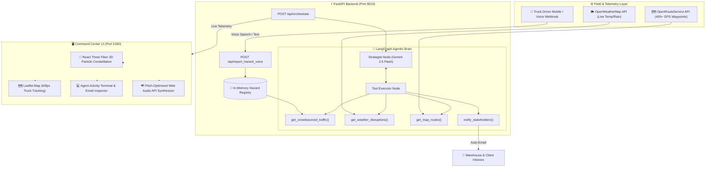
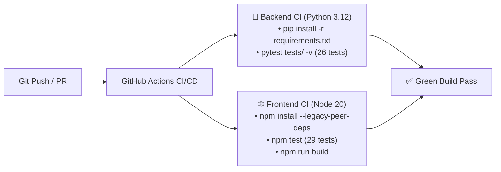

# 🚛 LogiPulse // Autonomous Supply Chain Crisis Orchestrator

[](https://github.com/Arkz-Deepak/agentic-supply-chain/actions)
[-brightgreen?style=for-the-badge&logo=pytest)](https://github.com/Arkz-Deepak/agentic-supply-chain)
[](https://vercel.com)
[](https://python.org)
[](https://fastapi.tiangolo.com)
[](https://langchain-ai.github.io/langgraph/)
[](https://ai.google.dev)
[](https://react.dev)
[](https://threejs.org)
[](https://tailwindcss.com)
[](https://www.iitbbs.ac.in)
[](#)

> **Self-healing logistics networks powered by LangGraph, Google Gemini, OpenRouteService, and OpenWeatherMap.**  
> Built for **Tech Zephyr 4.0** at **IIT Bhubaneswar** by **Team Arkz**.

---

## 📚 Table of Contents
- [📸 Interactive System Tour & Screenshots](#-interactive-system-tour--screenshots)
- [🌟 Executive Summary](#-executive-summary)
- [🗺️ Default Route & Regional Freight Corridors](#️-default-route--regional-freight-corridors)
- [🔄 Dynamic Standby Paradigm & On-Demand Route Generation](#-dynamic-standby-paradigm--on-demand-route-generation)
- [📐 Dynamic Orthogonal Bypass Mathematics](#-dynamic-orthogonal-bypass-mathematics)
- [🏗️ End-to-End System Architecture](#️-end-to-end-system-architecture)
- [🧪 Comprehensive Unit & Integration Test Suite (55 Tests)](#-comprehensive-unit--integration-test-suite)
- [🚀 Quick Start Guide](#-quick-start-guide)
- [🔄 CI/CD Pipeline (GitHub Actions)](#-cicd-pipeline-github-actions)
- [🚀 Vercel Deployment Guide](#-vercel-deployment-guide)
- [📡 API Reference](#-api-reference)
- [🎯 Hackathon Presentation Pitch Script](#-hackathon-presentation-pitch-script)
- [📖 Detailed Documentation Links](#-detailed-documentation-links)

---

## 📸 Interactive System Tour & Screenshots

| Standby: Point A & Point B Initial Standby | Phase 1: High-Tech Telemetry & GPS Navigation |
| :---: | :---: |
|  |  |
| *Only Point A (Origin) & Point B (Destination) pinned; path generated on click.* | *Primary arterial mapped with real OpenRouteService waypoints & live carrier TRK-8821.* |

| Phase 2: Natural Voice Hazard Transmission | Phase 2: Live Roadblock & Autonomous Braking |
| :---: | :---: |
|  |  |
| *Drivers report accidents, wood blockages, or floods via conversational speech.* | *Carrier halts automatically; Gemini dynamically classifies incident category & severity.* |

<p align="center">
  <b>Phase 3: Autonomous Green Bypass Reroute & Stakeholder Notification Email</b><br/>
  
  &nbsp;&nbsp;
  
  <br/>
  <i>LangGraph Strategist calculates the optimal green bypass and delivers urgent dispatch advisories with verified ETAs to client & warehouse inboxes.</i>
</p>

---

## 🌟 Executive Summary

Global supply chains lose billions of dollars annually due to static routing engines that fail when unpredicted real-world disruptions strike. When a multi-vehicle highway accident occurs, storm debris drops fallen logs across an arterial corridor, or a sudden flood halts transport, legacy ERP systems wait hours for human dispatchers to intervene.

**LogiPulse** replaces static dispatching with an **autonomous agentic command center**:
1. **Initial Standby & On-Demand Path Generation**: When loaded or when new points/presets are picked, the map shows only Point A and Point B. The route is computed dynamically only when the operator triggers **Phase 1: Calculate Route**.
2. **Dynamic Speech-to-NLP Incident Extraction**: Field drivers speak naturally into their browser or mobile microphone (e.g. *"Terrible accident near Maduravoyal on Chennai Port Corridor, container overturned across both lanes!"*). Google Gemini classifies the exact category (`ACCIDENT`, `FALLEN_TREE_WOOD`, `WATERLOGGING_FLOOD`, `PROTEST_STRIKE`, `ROAD_BLOCKAGE`) and extracts location and severity with zero human delay.
3. **100% Dynamic Orthogonal Detour Geometry**: Rather than hardcoded pre-baked bypasses, LogiPulse derives orthogonal normal vectors $(-V_{\text{lon}}, V_{\text{lat}}) \times \text{ratio}$ around the dynamic incident point, querying OpenRouteService dynamically worldwide.
4. **LangGraph Strategist Reasoning**: Evaluates crowdsourced hazard reports, real-time meteorological conditions (OpenWeatherMap), and actual highway topography (OpenRouteService).
5. **Cross-Sensor Telemetry Verification**: Intelligently diagnoses localized infrastructure failures when flood reports conflict with 0.0mm radar precipitation.
6. **Automated Stakeholder Dispatch**: The agent autonomously drafts and transmits formal emergency notifications to the warehouse manager and client with verified ETAs.

---

## 🗺️ Default Route & Regional Freight Corridors

The system defaults to high-volume coastal container freight and supports quick regional presets or full interactive coordinate placement anywhere on earth:

### 1. Default Freight Corridor (Tamil Nadu):
- **Origin (Point A)**: **Chennai Port Container Terminal** (`[13.0838, 80.2980]`)
- **Destination (Point B)**: **Oragadam Industrial Corridor** (`[12.8350, 79.9500]`)
- **Primary Arterial**: Chennai Port Express Arterial (via Poonamallee & Maduravoyal)
- **Autonomous Bypass**: Chennai Outer Ring Road (ORR Green Express Bypass) (+8 mins)

### 2. Odisha Regional Corridors (IIT Bhubaneswar):
- **Bhubaneswar &rarr; IIT BBS**: Rasulgarh Central Depot &rarr; Khandagiri &rarr; IIT BBS South Gate (via Daya West Canal Bypass, +7 mins).
- **Paradip Port &rarr; IIT BBS**: Paradip Deepwater Port &rarr; Cuttack-Puri Radial &rarr; IIT BBS Argul Campus.

### 3. Interactive Map Pin Placement:
- Click **"Origin (A)"** and click anywhere on the world map.
- Click **"Destination (B)"** and click another location on the map.
- Click **"Phase 1: Calculate Route"** to generate an on-demand freight route anywhere worldwide!

---

## 🔄 Dynamic Standby Paradigm & On-Demand Route Generation

To give logistics managers complete operational control:
- **No Upfront Routes**: Upon loading the application or selecting presets, **no route paths or trucks appear**.
- **Clear Point A & Point B Markers**: Only the green Point A pin (Origin) and blue Point B pin (Destination) render on the map.
- **Standby Metrics**: The telemetry card displays `--` for distance and ETA, with an active badge indicating `AWAITING PHASE 1`.
- **Phase 1 Execution**: Clicking **"Phase 1: Calculate Route"** computes real highway topography via OpenRouteService, draws the blue corridor, dispatches carrier unit `TRK-8821`, and activates telemetry.

---

## 📐 Dynamic Orthogonal Bypass Mathematics

When an incident strikes at coordinate $H$ along route vector $\vec{V} = (\Delta \text{lat}, \Delta \text{lon})$, LogiPulse derives the perpendicular normal vector:
$$\vec{N} = \left( -\Delta \text{lon}, \; \Delta \text{lat} \right)$$

The bypass waypoint is placed dynamically at:
$$P_{\text{bypass}} = H + \vec{N} \times \delta$$

This intermediate waypoint is queried via OpenRouteService for real highway road geometry, with geodesic Haversine Bezier fallback if external networks are offline.

---

## 🏗️ End-to-End System Architecture



---

## 🧪 Comprehensive Unit & Integration Test Suite

LogiPulse features **55 automated unit and integration tests** passing with 100% success across the backend, LangGraph agent machine, and React frontend:

| Test Layer | Framework | Test Count | Pass Rate | Scope Covered |
| :--- | :--- | :---: | :---: | :--- |
| **Backend REST APIs** | `pytest` + `httpx` | 10 | 100% | Healthcheck, Weather API, Route Directions, Hazard Ingestion, Speech-to-NLP parsing |
| **LangGraph Agent Engine** | `pytest` + `langgraph` | 9 | 100% | State persistence, Multi-tier corridor escalation (Tier 1 &rarr; 2 &rarr; 3 &rarr; 4), Cross-sensor flood conflict diagnosis |
| **Logistics Tools** | `pytest` | 7 | 100% | Live weather radar fallback, ORS waypoint queries, stakeholder email dispatching |
| **Frontend UI Components** | `vitest` + `@testing-library/react` | 8 | 100% | RouteStatsCard metrics, DisruptionBanner states, ControlPanel user interactions |
| **Frontend API Client** | `vitest` + `axios` | 8 | 100% | Resilient fallback simulators, weather fetchers, voice webhook error handling |
| **Geometry & Data Utilities** | `vitest` | 8 | 100% | Orthogonal bypass calculations, polyline coordinate interpolation, preset hubs |
| **Audio Synthesizer** | `vitest` | 5 | 100% | Web Audio API oscillator lifecycles, volume ramping, toggle controls |
| **TOTAL** | | **55 Tests** | **100% Passed** | **Zero failures, full regression safety** |

### Running Backend Tests
```powershell
# In project root:
.\venv\Scripts\pytest tests/ -v
```

### Running Frontend Tests
```powershell
# In frontend directory:
cd frontend
npm test
```

---

## 🚀 Quick Start Guide

### Prerequisites
- **Python 3.10+** (Tested on Python 3.13)
- **Node.js 18+** & **npm**

### 1. Clone & Configure `.env`
```bash
git clone https://github.com/Arkz-Deepak/agentic-supply-chain.git
cd agentic-supply-chain
```

Create a `.env` file in the project root:
```env
GEMINI_API_KEY=your_google_gemini_api_key
MAP_API_KEY=your_openrouteservice_api_key
WEATHER_API_KEY=your_openweathermap_api_key
```

---

### 2. Launch the FastAPI Backend (Port 8010)

```powershell
# In root directory:
.\venv\Scripts\python.exe -m uvicorn server:app --app-dir src --host 0.0.0.0 --port 8010 --reload
```
*Backend runs at: **http://localhost:8010***  
*Interactive Swagger API documentation: **http://localhost:8010/docs***

---

### 3. Launch the Vite Frontend (Port 5180)

```powershell
# In frontend directory:
cd frontend
npm install
npm run dev
```
*Command Center runs at: **http://localhost:5180***

---

## 🔄 CI/CD Pipeline (GitHub Actions)

Every pull request and push to `main` or `phase-1` is automatically validated through our GitHub Actions workflow ([`.github/workflows/ci.yml`](.github/workflows/ci.yml)):



---

## 🚀 Vercel Deployment Guide

LogiPulse is 100% optimized for **Vercel** deployment:

### Monorepo Deployment on Vercel
The repository includes root [`vercel.json`](vercel.json) and an ASGI serverless handler in [`api/index.py`](api/index.py).

1. Import your GitHub repository into [Vercel Dashboard](https://vercel.com).
2. Set the **Framework Preset** to `Vite`.
3. In **Environment Variables**, configure:
   - `GEMINI_API_KEY`: Your Google Gemini API Key
   - `WEATHER_API_KEY`: Your OpenWeatherMap Key
   - `MAP_API_KEY`: Your OpenRouteService Key
4. Deploy! Vercel compiles static assets to `frontend/dist` and routes `/api/*` to the serverless ASGI function.

---

## 📡 API Reference

For detailed request/response schemas and curl examples, see **[`docs/API.md`](docs/API.md)**.

| Endpoint | Method | Description |
| :--- | :---: | :--- |
| `/api/health` | `GET` | Healthcheck and active system capabilities |
| `/api/weather` | `GET` | Live meteorological telemetry from OpenWeatherMap |
| `/api/routes/directions` | `POST` | Highway driving waypoints from OpenRouteService |
| `/api/report_hazard` | `POST` | Structured IoT or manual incident reporting |
| `/api/report_hazard_voice`| `POST` | Natural language driver speech-to-NLP (Gemini Flash) |
| `/api/orchestrate` | `POST` | Full LangGraph agent multi-sensor workflow |
| `/api/hazards` | `DELETE`| Clears in-memory active hazard reports |

---

## 🎯 Hackathon Presentation Pitch Script

For the comprehensive demonstration script and anticipated judge defenses, see **[`docs/PITCH_DEMO_GUIDE.md`](docs/PITCH_DEMO_GUIDE.md)**.

| Stage | Action on Screen | Audio / Visual Result | What to Say to the Judges |
| :--- | :--- | :--- | :--- |
| **1. Standby Intro** | Open `http://localhost:5180` | Map frames Point A & Point B with floating standby callout. Zero premature paths. | *"Notice the clean standby state: only Origin Point A and Destination Point B are pinned. The system avoids drawing assumptions until the operator initiates the mission."* |
| **2. Phase 1 Dispatch** | Click **"Phase 1: Calculate Route"** | Mechanical click sounds. Real OpenRouteService polyline illuminates. Carrier TRK-8821 begins driving. Telemetry metrics activate. | *"In Phase 1, LogiPulse establishes the optimal commercial freight corridor between Chennai Port Container Terminal and Oragadam Industrial Corridor."* |
| **3. Phase 2 Crisis** | Click **"Phase 2: Speak Driver Report 🎙️"** | Dispatch alert tone sounds. Gemini dynamically classifies crisis. Red pulsing hazard appears. **The truck physically brakes and halts.** | *"Disaster strikes! The driver reports an incident in conversational speech. Gemini dynamically identifies the category (accident, wood blockage, or flood). The truck halts instantly."* |
| **4. Agent Action** | Click **"AUTONOMOUS AGENT REROUTE"** | Terminal stream logs Gemini evaluating crowdsourced telemetry, calculating orthogonal bypass, and dispatching stakeholder notices. | *"Instead of stalling for hours, our LangGraph agent evaluates live radar, computes the orthogonal green bypass, and drafts emergency stakeholder emails."* |
| **5. Resolution** | Automatic transition | Harmonic chime plays. Emerald bypass corridor illuminates. **The truck pivots onto the green bypass and drives safely to destination.** | *"The delivery is saved with only an +8 minute delta. The Email tab proves the formal dispatch notice was autonomously delivered to the warehouse manager."* |

---

## 📖 Detailed Documentation Links

- 🏗️ **[Technical Architecture & Algorithms](docs/ARCHITECTURE.md)**: Deep dive into LangGraph state machine, dynamic orthogonal bypass math, multi-corridor hierarchy, and cross-sensor flood verification.
- 📡 **[REST API Reference & Schemas](docs/API.md)**: Complete request/response schemas, JSON payloads, and cURL examples.
- 🎯 **[Hackathon Pitch & Demo Guide](docs/PITCH_DEMO_GUIDE.md)**: Step-by-step presentation script, judge Q&A, and technical defenses.

---

## 🛡️ License

This project is open-source under the **MIT License**. Built with pride by **Team Arkz** for **Tech Zephyr 4.0** at **IIT Bhubaneswar**.