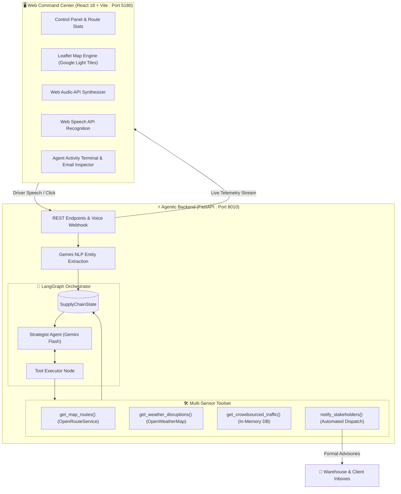
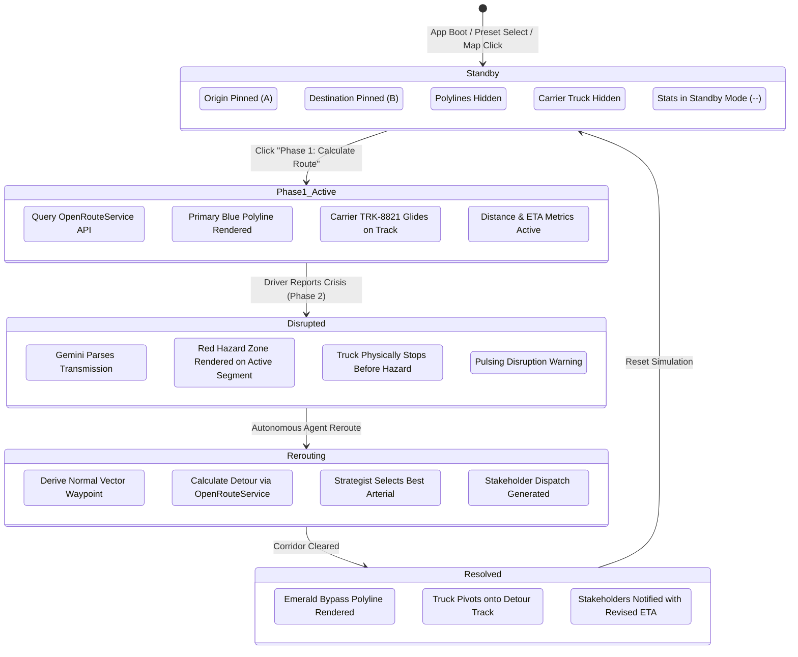

# 🏗️ LogiPulse Technical Architecture & System Design

This document details the internal architecture, algorithmic design, and agentic workflows of **LogiPulse**, an autonomous supply chain crisis orchestrator developed by **Team Arkz** for **Tech Zephyr 4.0** at **IIT Bhubaneswar**.

---

## 1. High-Level Architectural Overview

LogiPulse transforms static logistics pipelines into self-healing, agentic transport networks. The system is split across two high-performance tiers:



---

## 2. Dynamic Route Lifecycle & Standby Paradigm

Unlike legacy dispatch systems that lock to hardcoded routes or immediately draw paths upon loading, LogiPulse follows a **Strict Standby Lifecycle**:



### Key Standby Principles:
1. **Initial Mount**: Only Point A and Point B are pinned. Zero lines or vehicles are rendered until the operator explicitly clicks **"Phase 1: Calculate Route"**.
2. **Dynamic Bounds Fitting**: Leaflet's `RouteBoundsFitter` calculates bounding coordinates between Point A and Point B when no path exists, framing the mission area smoothly.
3. **Preset Switching**: Switching presets (e.g. *Chennai Port → Oragadam* or *Bhubaneswar → IIT BBS*) resets polylines to `null`, pins the new hubs, and returns to standby awaiting Phase 1.

---

## 3. Dynamic Orthogonal Bypass Mathematics

When a disruption strikes at coordinate $H = (\text{lat}_H, \text{lon}_H)$ along a vector connecting origin $A$ and destination $B$, LogiPulse calculates a geometric detour without relying on pre-baked waypoints.

### Mathematical Formulation:
Given the normalized route vector:
$$\vec{V} = \left( \text{lat}_B - \text{lat}_A, \; \text{lon}_B - \text{lon}_A \right)$$

We derive the perpendicular unit normal vector $\vec{N}$:
$$\vec{N} = \left( -V_{\text{lon}}, \; V_{\text{lat}} \right)$$

The dynamic bypass pivot waypoint $P_{\text{bypass}}$ is calculated as:
$$P_{\text{bypass}} = H + \vec{N} \times \delta$$
where $\delta$ is the dynamic detour ratio ($\delta \approx 0.040$ for primary bypass, $\delta \approx 0.065$ for secondary bypass).

```
          Point A (Origin)
               \
                \
                 \
                  [ HAZARD H ] -------> P_bypass (Orthogonal Detour)
                 /                      /
                /                      /
               /                      /
         Point B (Destination) <-----'
```

The resulting pivot point is supplied as an intermediate waypoint to OpenRouteService:
$$\text{POST } /api/routes/directions \quad \text{with waypoints } [A, P_{\text{bypass}}, B]$$
If external APIs are unreachable, LogiPulse's geodesic fallback engine interpolates smooth Bezier curves using the Haversine formula:
$$d = 2R \arcsin\left(\sqrt{\sin^2\left(\frac{\Delta \phi}{2}\right) + \cos(\phi_1)\cos(\phi_2)\sin^2\left(\frac{\Delta \lambda}{2}\right)}\right)$$

---

## 4. LangGraph Multi-Tier Escalation Hierarchy

To ensure the agent never falls into circular routing loops when multiple roads are blocked, the LangGraph state machine maintains memory of `blocked_corridors`.

### Corridor Hierarchies:

#### Southern Freight Zone (Chennai Port → Oragadam Industrial Corridor)
| Tier | Corridor Name | Type | Characteristics |
| :---: | :--- | :--- | :--- |
| **Tier 1** | `chennai_port_arterial` | Primary Highway | Chennai Port → Poonamallee → Maduravoyal → NH-48 Express |
| **Tier 2** | `chennai_orr_bypass` | Primary Detour | Outer Ring Road (ORR Green Express Bypass) (+8 mins) |
| **Tier 3** | `sriperumbudur_arterial` | Secondary Detour | Sriperumbudur Industrial Radial Link (+14 mins) |
| **Tier 4** | `manali_coastal_link` | Western Perimeter | Manali Coastal Arterial (+22 mins) |

#### Eastern Freight Zone (Bhubaneswar Central Depot → IIT Bhubaneswar)
| Tier | Corridor Name | Type | Characteristics |
| :---: | :--- | :--- | :--- |
| **Tier 1** | `route_99` | Primary Highway | NH-16 National Arterial (Rasulgarh → Khandagiri → Pitapalli) |
| **Tier 2** | `route_101_express` | Primary Detour | Daya West Canal Green Link & Sundarpada Bypass (+7 mins) |
| **Tier 3** | `route_202_outer` | Secondary Detour | Cuttack-Puri Outer Radial & Pipili Link (+13 mins) |
| **Tier 4** | `route_303_perimeter` | Western Perimeter | Chandaka Forest Western Arterial (+19 mins) |

### Anti-Looping Guarantee:
The `Strategist` node filters available corridors against `state["blocked_corridors"]`:
$$\text{Available} = \text{Hierarchy} \setminus \text{blocked\_corridors}$$
The agent always escalates forward ($\text{Tier } k \to \text{Tier } k+1$) and never loops back to an obstructed road.

---

## 5. Cross-Sensor Telemetry Verification

A key agentic innovation in LogiPulse is **Cross-Sensor Conflict Diagnosis**:
When a driver reports a "severe flash flood" or "waterlogging":
1. The agent executes `get_weather_disruptions()` querying OpenWeatherMap radar.
2. If the radar reports $0.0\,\text{mm}$ rain and dry clear skies:
   - Traditional automation would drop the alert as a "false positive".
   - **LogiPulse Agentic Reasoning**: The agent recognizes that physical road blockages can occur from localized non-meteorological causes (*municipal storm drain burst, irrigation canal overflow, or commercial pipe rupture*).
3. **Outcome**: The agent generates a **Precautionary Safety Detour**, logs the sensor discrepancy, and notes the diagnosis on the emergency stakeholder email.

---

## 6. Frontend 60 FPS Jitter-Free Vehicle Physics

Carrier vehicle `TRK-8821` glides along the polyline using a high-performance animation architecture:
- **Direct Leaflet Marker Mutation**: Updates marker coordinates directly via `marker.setLatLng()` inside a `requestAnimationFrame` loop, bypassing React reconciliation overhead for silky 60 FPS performance.
- **Continuous Bearing Unwrapping**: Prevents 360° reverse spin when crossing the 0°/360° north boundary:
  ```javascript
  function unwrapAngle(target, current) {
    let diff = (target - current) % 360;
    if (diff < -180) diff += 360;
    if (diff > 180) diff -= 360;
    return current + diff;
  }
  ```
- **Exponential Moving Average (EMA) Smoothing**: Filters raw road heading angles with an EMA factor of `0.12` to guarantee smooth, stable orientation transitions around sharp turns.
- **Dynamic Emergency Braking**: When a disruption is detected, the vehicle continuously computes distance to the dynamic hazard coordinate and decelerates smoothly to a complete halt $40\,\text{meters}$ before the hazard boundary.